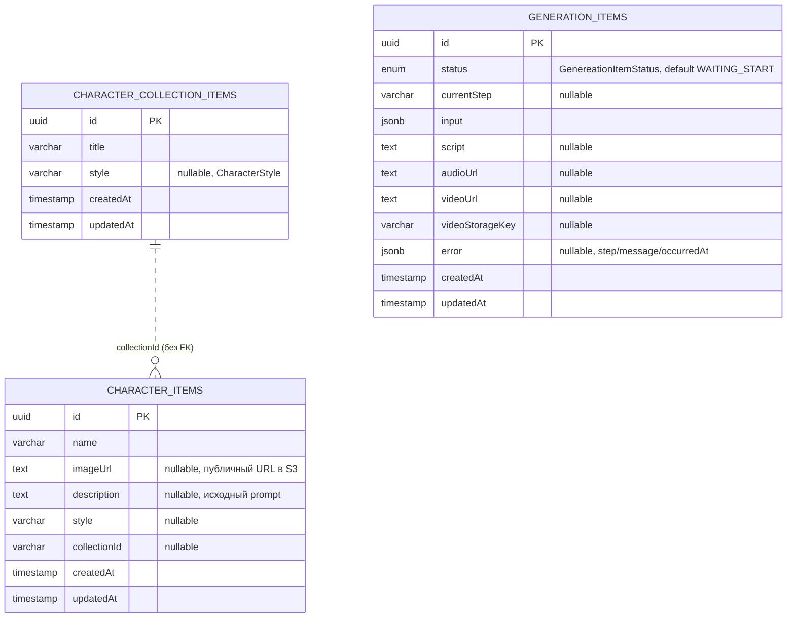

# Модель данных

Три таблицы Postgres, которые создаёт `autoLoadEntities` + `synchronize` (см. «Схема БД» ниже). Связь между
коллекцией и персонажем логическая, без внешнего ключа на уровне схемы.

## Сущности

### `CharacterCollectionItemEntity`

Путь: `src/character-gallery/entities/character-item.entity.ts`. Таблица: `character_collection_items`.

| Колонка | Тип | Nullable |
|---|---|---|
| `id` | `uuid` (PK, generated) | нет |
| `title` | `varchar` | нет |
| `style` | `varchar` | да |
| `createdAt` | `timestamp` | нет (создаётся автоматически) |
| `updatedAt` | `timestamp` | нет (обновляется автоматически) |

### `CharacterItemEntity`

Путь: `src/character-gallery/entities/character-item.entity.ts` (тот же файл, что и коллекция). Таблица:
`character_items`.

| Колонка | Тип | Nullable |
|---|---|---|
| `id` | `uuid` (PK, generated) | нет |
| `name` | `varchar` | нет |
| `imageUrl` | `text` | да |
| `description` | `text` | да |
| `style` | `varchar` | да |
| `collectionId` | `varchar` | да |
| `createdAt` | `timestamp` | нет |
| `updatedAt` | `timestamp` | нет |

### `GenerationItemEntity`

Путь: `src/generations/generation-item/entities/generation-item.entity.ts`. Таблица: `generation_items`.

| Колонка | Тип | Nullable |
|---|---|---|
| `id` | `uuid` (PK, generated) | нет |
| `status` | `enum GenereationItemStatus`, default `WAITING_START` | нет |
| `currentStep` | `varchar` | да |
| `input` | `jsonb` | нет |
| `script` | `text` | да |
| `audioUrl` | `text` | да |
| `videoUrl` | `text` | да |
| `videoStorageKey` | `varchar(512)` | да |
| `error` | `jsonb` (`{ step, message, occurredAt }`) | да |
| `createdAt` | `timestamp` | нет |
| `updatedAt` | `timestamp` | нет |

## Статусы generation item

`GenereationItemStatus` (`src/shared/constants/generation-item.ts`) — имя enum содержит опечатку
(`Genereation` вместо `Generation`), она сохранена намеренно (см. `AGENTS.md`, «не чинить молча»).
Значения:

| Имя в enum | Значение |
|---|---|
| `Pending` | `PENDING` |
| `Running` | `RUNNING` |
| `Failed` | `FAILED` |
| `Completed` | `COMPLETED` |
| `WaitingStart` | `WAITING_START` (дефолт колонки `status`) |

На сегодня статусы нигде в коде не переключаются: `GenerationItemService.create` только сохраняет запись со
статусом из DTO (или дефолтным `WAITING_START`), а `CreateVideoService` (реальный конвейер) вообще не
обращается к таблице `generation_items`. Подробнее — [`known-issues.md`](./known-issues.md).

## Схема БД

Связь `collectionId` между `character_items` и `character_collection_items` — логическая (по значению
строки), без внешнего ключа в схеме Postgres.

`TypeOrmModule.forRoot` (`src/app.module.ts`) настроен с `autoLoadEntities: true` (сущности из модулей
подхватываются автоматически, без явного перечисления) и `synchronize: process.env.NODE_ENV !==
'production'` — в dev-режиме схема Postgres накатывается автоматически при старте приложения. Миграций
TypeORM в репозитории нет.
