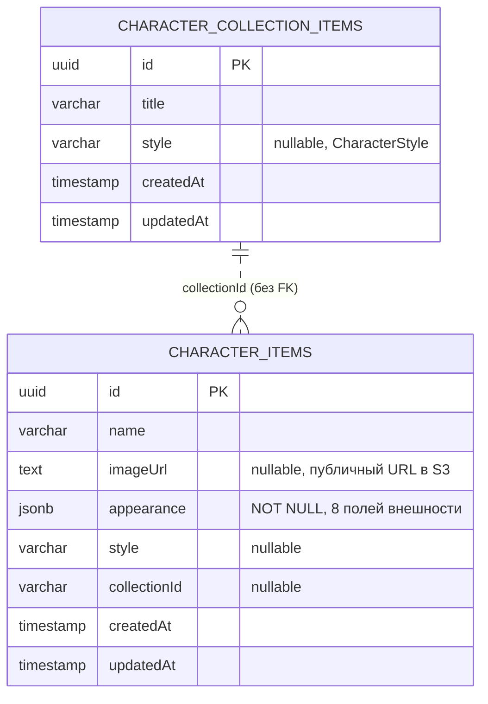

# Модель данных

Две таблицы Postgres, которые создаёт `autoLoadEntities` + `synchronize` (см. «Схема БД» ниже). Связь между
коллекцией и персонажем логическая, без внешнего ключа на уровне схемы.

## Сущности

### `CharacterCollectionItemEntity`

Путь: `src/character-gallery/entities/character-item.entity.ts`. Таблица: `character_collection_items`.

| Колонка | Тип | Nullable |
|---|---|---|
| `id` | `uuid` (PK, generated) | нет |
| `title` | `varchar` | нет |
| `style` | `varchar` | да |
| `createdAt` | `timestamp` | нет (создаётся автоматически) |
| `updatedAt` | `timestamp` | нет (обновляется автоматически) |

### `CharacterItemEntity`

Путь: `src/character-gallery/entities/character-item.entity.ts` (тот же файл, что и коллекция). Таблица:
`character_items`.

| Колонка | Тип | Nullable |
|---|---|---|
| `id` | `uuid` (PK, generated) | нет |
| `name` | `varchar` | нет |
| `imageUrl` | `text` | да |
| `appearance` | `jsonb` (8 полей внешности) | нет |
| `style` | `varchar` | да |
| `collectionId` | `varchar` | да |
| `createdAt` | `timestamp` | нет |
| `updatedAt` | `timestamp` | нет |

Внимание: `appearance` — NOT NULL, `description` удалён. Миграций нет (`synchronize`); перед запуском на dev-БД строки `character_items` нужно очистить вручную.

## Схема БД

Связь `collectionId` между `character_items` и `character_collection_items` — логическая (по значению
строки), без внешнего ключа в схеме Postgres.

`TypeOrmModule.forRoot` (`src/app.module.ts`) настроен с `autoLoadEntities: true` (сущности из модулей
подхватываются автоматически, без явного перечисления) и `synchronize: process.env.NODE_ENV !==
'production'` — в dev-режиме схема Postgres накатывается автоматически при старте приложения. Миграций
TypeORM в репозитории нет.
