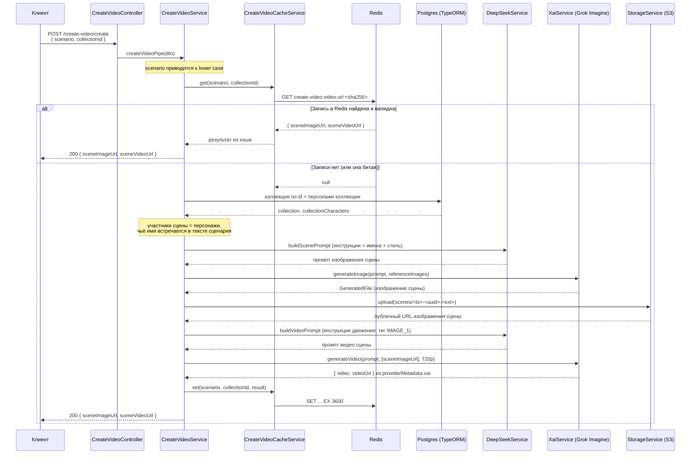
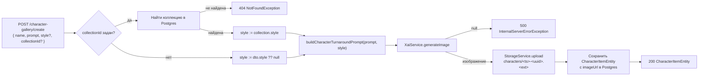

# Сквозные потоки

## Конвейер создания видео (`POST /create-video/create`)

`CreateVideoController.creaate` (`src/create-video/create-video.controller.ts`; имя метода — опечатка,
сохранена намеренно, см. `known-issues.md`) принимает `CreateRequestDto` и вызывает
`CreateVideoService.createVideoPipe` (`src/create-video/create-video.service.ts`):

1. `scenario` приводится к нижнему регистру (`data.scenario.toLowerCase()`).
2. Сервис обращается в кэш конвейера (см. ниже); при попадании — сразу возвращает закэшированный результат.
3. При промахе — параллельно (`Promise.all`) читает коллекцию по `collectionId` и всех персонажей этой
   коллекции из Postgres.
4. Участники сцены — персонажи коллекции, чьё имя (в нижнем регистре) встречается в тексте сценария
   (`scenario.includes(name.toLowerCase())`); их изображения (`imageUrl`) идут как `referenceImages`.
5. Промпт изображения сцены строится `DeepSeekService.generate` из шаблонных инструкций
   (`SCENE_IMAGE_PROMPT_INSTRUCTIONS`), подсказки об участниках и стиле коллекции, и самого сценария; при
   пустом ответе DeepSeek используется сам `scenario` как промпт.
6. Изображение сцены генерируется через `XaiService.generateImage`; при `null` — `500
   InternalServerErrorException`.
7. Изображение загружается в S3 под ключом `scenes/<Date.now()>-<randomUUID()>.<ext>` (расширение — из
   `mediaType` файла, фолбэк `png`); полученный публичный URL — `sceneImageUrl`.
8. Промпт видео строится похожим образом (`SCENE_VIDEO_PROMPT_INSTRUCTIONS`, тег `<IMAGE_1>` подразумевает
   сгенерированное изображение); фолбэк при пустом ответе DeepSeek — `` `<IMAGE_1> comes to life: ${scenario}` ``.
9. Видео сцены генерируется через `XaiService.generateVideo` с разрешением `720p` и `referenceImageUrls:
   [sceneImageUrl]`; при отсутствии `videoUrl` — `500 InternalServerErrorException`.
10. Ссылка на видео берётся из `providerMetadata.xai.videoUrl` ответа `generateVideo` — это ссылка самого
    провайдера xAI, а не файл в собственном хранилище (см. `CONTEXT.md` → «Ссылка провайдера на видео»).
11. Результат `{ sceneImageUrl, sceneVideoUrl }` кладётся в кэш и возвращается клиенту.

### Кэш конвейера

`CreateVideoCacheService` (`src/create-video/create-video-cache.service.ts`):

- **Ключ** — `create-video:video-url:` + `sha256(scenario.toLowerCase() + '|' + collectionId)`, где префикс
  и способ построения хэша заданы в `buildKey`; константа префикса —
  `CREATE_VIDEO_URL_KEY_PREFIX` (`src/create-video/constants/video-url-storage.constant.ts`).
- **TTL** — `CREATE_VIDEO_URL_TTL_SECONDS = 3_600` секунд (`SET ... EX 3600`).
- **Поведение при ошибке Redis** — и `get`, и `set` оборачивают вызов в `try/catch`: при ошибке она
  логируется (`this.logger.error({ event: 'create-video-cache.get.failed' | 'create-video-cache.set.failed',
  ... })`) и проглатывается — `get` возвращает `null`, `set` просто ничего не сохраняет. Запрос в обоих
  случаях продолжается обычным путём, деградация без падения.

## Создание персонажа (`POST /character-gallery/create`)

`CharacterGalleryController.createCharacter` вызывает `CharacterGalleryService.createCharacter`
(`src/character-gallery/character-gallery.service.ts`):

1. Если в `dto` задан `collectionId`, сервис ищет коллекцию в Postgres; не найдена — `404
   NotFoundException`; найдена — стиль персонажа берётся из `collection.style` (стиль персонажа коллекции
   всегда наследуется от коллекции, `dto.style` в этом случае игнорируется).
2. Если `collectionId` не задан — стиль берётся из `dto.style ?? null`.
3. Промпт для генерации строится `buildCharacterTurnaroundPrompt(prompt, style)`
   (`src/character-gallery/utils/character-image-prompt.util.ts`).
4. Изображение генерируется через `XaiService.generateImage`; при `null` — `500
   InternalServerErrorException`.
5. Изображение загружается в S3 под ключом `characters/<Date.now()>-<randomUUID()>.<ext>`.
6. `CharacterItemEntity` сохраняется в Postgres с `imageUrl`, `description` (= исходный `prompt`), `style`,
   `collectionId`.

Второй эндпоинт контроллера, `POST /character-gallery/collection/create`
(`createCharacterCollection`), просто сохраняет `CharacterCollectionItemEntity` — без обращений к внешним
провайдерам.

## Синхронность

Оба потока выполняются целиком внутри одного HTTP-запроса: конвейер создания видео делает два вызова
DeepSeek, генерацию изображения и видео через xAI и загрузку в S3 — без очередей, ретраев или таймаутов на
уровне приложения. Это значит, что время ответа `POST /create-video/create` равно сумме времени всех
внешних вызовов подряд. См. [`known-issues.md`](./known-issues.md) (находка «конвейер синхронный и
долгий»).
